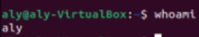

# Een VM installeren

Linux is, net als Windows of MacOS, een besturingssysteem. 
Het regelt de communicatie tussen het fysieke apparaat (hardware) en alle computerprogramma's (software).
Linux is het populairste besturingssysteem voor servers, omdat het lichtgewicht, stabiel, zeer aanpasbaar en gratis te gebruiken is. 
Door de open bron licenties mag iedereen nieuwe versies van Linux bouwen en distribueren.

## Key-terms

- GUI = Graphical user interface

- CLI = Command line interface

- VM = Virtual Machine

- OS = operating system 

## Opdracht

- Installeer een virtuele Ubuntu machine op uw laptop.
- Nadat de installatie en configuratie zijn voltooid, maakt u een momentopname van de virtuele machine. Dit fungeert als controlepunt voor het geval u de machine per ongeluk (of expres) kapot maakt.
- Ga naar de terminal in je VM en typ 'whoami'. De terminal zou uw gebruikersnaam moeten tonen.

## Gebruikte bronnen

geen.

## Ervaren problemen

geen.

## Resultaat

Door `whoami` commando te gebruiken.

