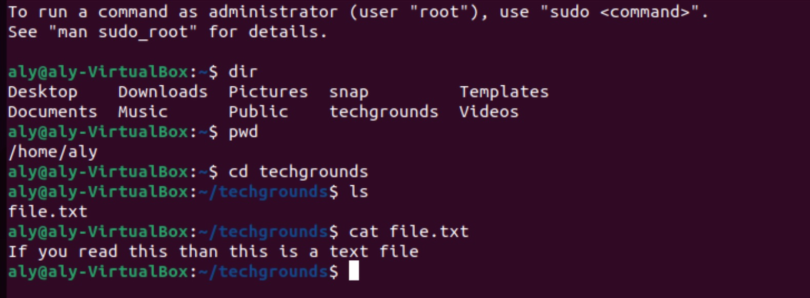

# Files en Directories

Linux gebruikt files en folders, net zo als je gewend bent met elk ander OS. 
Folders in Linux heten directories, gebruik dat woord "dir" als je zoekt voor commands of informatie.
Waneer je terminal opent, begin je vanuit je home directory. 
Vanuit de home directory kan je naar elke directorie navigeren met een paar commands.
De Linux file structuur begint vanaf de root directory, aangeduid met slash (/). 
Alle files en directories in Linux zijn vertegenwooridigd door hun path, beginnend vanaf de root.
De tilde (~) is te gebruiken als alias voor home directory.

## belangrijke termen met korte uitleg.

commando ls (list). ls dient om de inhoud van de huidige map weer te geven.
commando cp (copy) Kopieëer bestanden en directory's.
commando mv (move) Verplaats bestanden en directory's.
commando rm (remove) Verwijder bestanden en directory's.
commando mkdir (make directory) Maak een nieuwe directory aan.
commando rmdir (remove directory) Verwijder een lege directory.
commando pwd (print working directory) pwd dient om je huidige map te bekijken.
commando cd (change directory) is om van directory te veranderen. Bij het commando cd moet je wel een argument mee geven. 
Bijvoorbeeld als je naar de map "techgrounds" wil gaan, dan kan je het volgende commando gebruiken: cd techgrounds

## Opdracht

Vind je huidige working directory.
Maak een lijst van alle files en directories in je home directory. Je hoort bijvoorbeeld directories te zien als ‘Desktop’, ‘Public’ and ‘Pictures’.
In je home directory, maak je een nieuwe directory genaamd ‘techgrounds’.
Binnen de techgrounds directory, maak je een nieuwe file met inhoudelijke text.
Navigeer door de directory tree door middel van absolute en relative paths.

## Gebruikte bronnen

What is GitHub? 
https://www.youtube.com/watch?v=w3jLJU7DT5E

Absolute and Relative Pathnames in UNIX. 
https://www.geeksforgeeks.org/absolute-relative-pathnames-unix/

Linux voor beginners/De terminal. 
https://nl.wikibooks.org/wiki/Linux_voor_beginners/De_terminal

Linux Terminal commands and navigation for Beginners -Part1.
https://www.youtube.com/watch?v=AO0jzD1hpXc

Terminal Commands Lesson 04 - Editing Text Files - echo, cat, nano, vi. 
https://www.youtube.com/watch?v=s2bsE7MJTQg

## Ervaren problemen
Omdat ik nog onervaren ben in linux zorgen absolute en relative paths navigaties voor kleine verdwalingen en errors.

## Resultaat
De opdracht is goed gelukt zie screenshot

