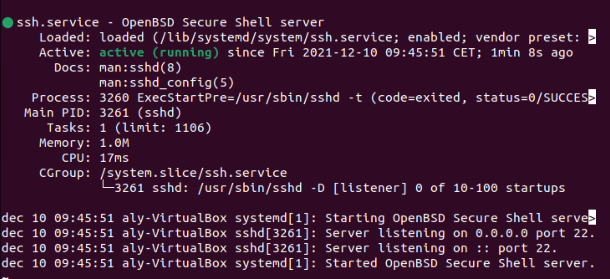
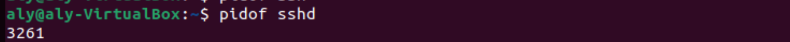
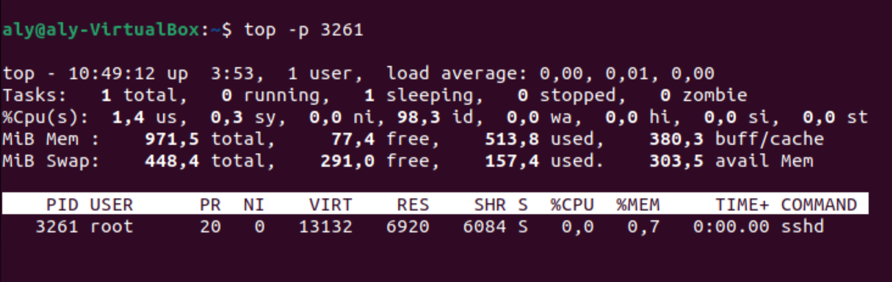
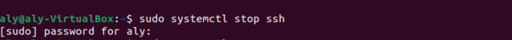
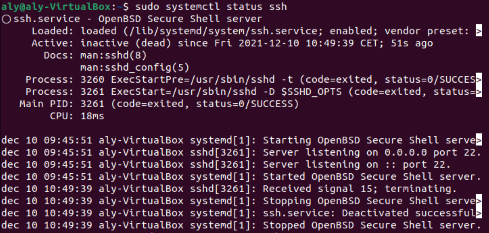

# Processen
Processen in Linux kunnen worden onderverdeeld in drie categorieën: Daemons, Services en Programma's.
Een daemon draait op de achtergrond en is niet interactief. Een Service reageert op verzoeken van programma's. Een dienst kan interactief zijn. Een programma wordt uitgevoerd en gebruikt door gebruikers (bijvoorbeeld Vim).

Om verbinding te maken met Linux-machines op afstand (virtueel of niet), kunt u ssh (secure shell) gebruiken. Om deze verbinding met uw machine mogelijk te maken, moet u de ssh-service starten door de ssh-daemon te starten.

Een proces is een instantie van actieve code. Alle code wordt ergens op het systeem in bestanden opgeslagen. Om deze bestanden te vinden, zal Linux in de $PATH variabele kijken (daarover meer in een latere oefening). Elk proces heeft zijn eigen PID (Process ID) nummer.
## Key-terms
- pgrep = a command-line utility that allows you to find the process IDs of a running program based on given criteria.
- service = a process or group of processes
- pmap = display the memory map of a process
- ssh = secure socket shell
- vim = vi improved

## Opdracht
- [Start de ssh-daemon.](#start-de-ssh-daemon)
- [Ontdek de PID van de ssh-daemon.](#ontdek-de-pid-van-de-ssh-daemon)
- [Zoek uit hoeveel geheugen de sshd gebruikt.](#zoek-uit-hoeveel-geheugen-de-sshd-gebruikt)
- [Stop of sluit het sshd-proces.](#stop-of-sluit-het-sshd-proces)

### Gebruikte bronnen
- [Ubuntu Linux: Start, Stop, Restart, Reload OpenSSH Server](https://www.cyberciti.biz/faq/howto-start-stop-ssh-server/)
- [How to Check Memory Usage Per Process on Linux](https://linuxhint.com/check_memory_usage_process_linux/)
- [Linux find process by name](https://www.cyberciti.biz/faq/linux-find-process-name/)
### Ervaren problemen
geen

### Resultaat

##### Start de ssh-daemon.
`sudo service ssh start`

##### Ontdek de PID van de ssh-daemon.       
`sudo service ssh status` or `pgrep ssh`

##### Zoek uit hoeveel geheugen de sshd gebruikt.
`sudo serivce ssh status` or `sudo pmap 11338` 

##### Stop of sluit het sshd-proces.
`sudo service ssh stop`

