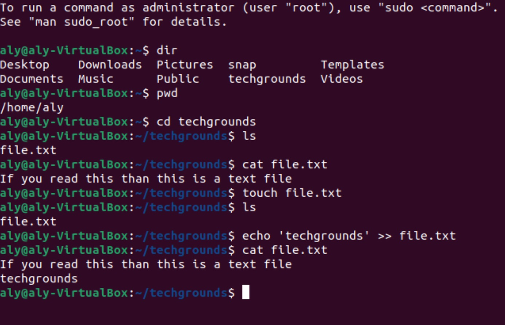
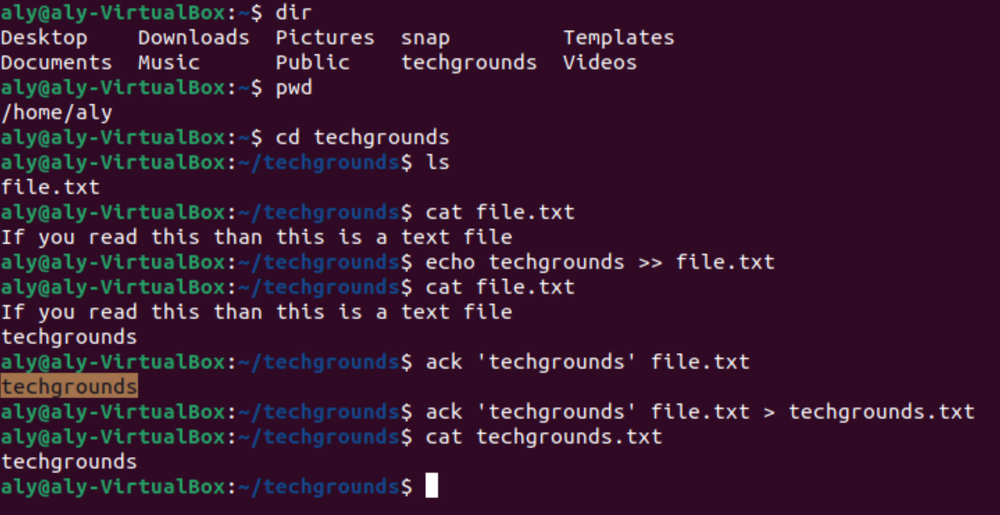

# Werken met tekst (CLI)

Elke opdracht in Linux heeft een standaard invoer en uitvoer. De standaard invoer (stdin) is het toetsenbord. 
Als ik 'mkdir myfolder' uitvoer, weet het mkdir-commando welke map moet worden gemaakt, omdat ik 'myfolder' heb getypt. 
De standaarduitgang (stdout) is de terminal. Het commando 'echo hallo' zal 'hallo' in de terminal schrijven.
Zowel de invoer als de uitvoer kunnen worden omgeleid naar een bestand in plaats van de standaard. 
Dit wordt invoeromleiding en uitvoeromleiding genoemd. Een pipe kan worden gebruikt om de uitvoer van een commando de invoer van een ander commando te laten zijn.

## Key-terms

“>” = operator for overwriting an already existing file or a new file

">>" = operator appends an already present file or creates a new file

cli = command-line interface

cat = concatenate

echo = display line of text/string that are passed as an argument

grep = Globally search for a Regular Expression

ack = Ack is designed as a replacement for 99% of the uses of grep

## Opdracht

Gebruik de echo-opdracht en uitvoeromleiding om een nieuwe zin in uw tekstbestand te schrijven met behulp van de opdrachtregel. 
De nieuwe zin moet het woord ‘techgrounds’ bevatten.
Gebruik een opdracht om de inhoud van uw tekstbestand naar de terminal te schrijven. 
Maak gebruik van een commando om de output te filteren zodat alleen de zin met ‘techgrounds’ verschijnt.
Lees je tekstbestand met het commando dat in de tweede stap is gebruikt, opnieuw filterend op het woord 'techgrounds'. 
Leid deze keer de uitvoer om naar een nieuw bestand met de naam 'techgrounds.txt'.

## Gebruikte bronnen

ack - Documentation

## Ervaren problemen

Voornamelijk zelf gemaakte syntax typo errors verder geen problemen samen met het team alles goed kunnen uitvoeren

## Resultaat

